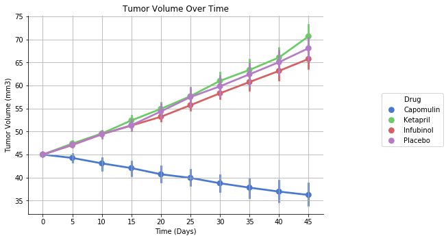
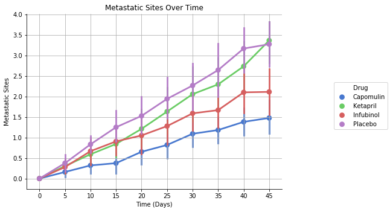
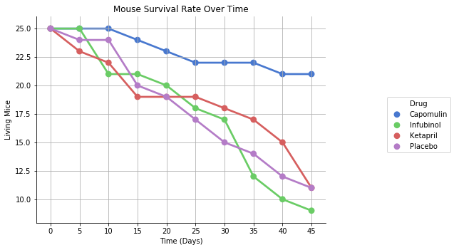
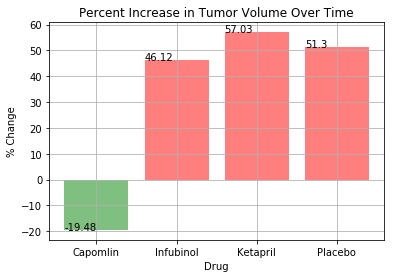

```python
#set dependencies
import pandas as pd
import numpy as np
import matplotlib.pyplot as plt
from scipy.stats import sem
import seaborn as sns
```


```python
#read the csv's
csvpath1 = ('../NUCHI201801DATA4-Class-Repository-DATA/MWS/Homework/05-Matplotlib/Instructions/Pymaceuticals/raw_data/clinicaltrial_data.csv')
csvpath2 = ('../NUCHI201801DATA4-Class-Repository-DATA/MWS/Homework/05-Matplotlib/Instructions/Pymaceuticals/raw_data/mouse_drug_data.csv')

clinicaltrial_df = pd.read_csv(csvpath1)
drugdata_df = pd.read_csv(csvpath2)

clinicaltrial_df.head()
```


<div>
<style>
    .dataframe thead tr:only-child th {
        text-align: right;
    }

    .dataframe thead th {
        text-align: left;
    }

    .dataframe tbody tr th {
        vertical-align: top;
    }
</style>
<table border="1" class="dataframe">
  <thead>
    <tr style="text-align: right;">
      <th></th>
      <th>Mouse ID</th>
      <th>Timepoint</th>
      <th>Tumor Volume (mm3)</th>
      <th>Metastatic Sites</th>
    </tr>
  </thead>
  <tbody>
    <tr>
      <th>0</th>
      <td>b128</td>
      <td>0</td>
      <td>45.0</td>
      <td>0</td>
    </tr>
    <tr>
      <th>1</th>
      <td>f932</td>
      <td>0</td>
      <td>45.0</td>
      <td>0</td>
    </tr>
    <tr>
      <th>2</th>
      <td>g107</td>
      <td>0</td>
      <td>45.0</td>
      <td>0</td>
    </tr>
    <tr>
      <th>3</th>
      <td>a457</td>
      <td>0</td>
      <td>45.0</td>
      <td>0</td>
    </tr>
    <tr>
      <th>4</th>
      <td>c819</td>
      <td>0</td>
      <td>45.0</td>
      <td>0</td>
    </tr>
  </tbody>
</table>
</div>


```python
#merge the two tables
trialdata_df = pd.merge(clinicaltrial_df, drugdata_df, on='Mouse ID', how='outer')
trialdata_df.head()
```


<div>
<style>
    .dataframe thead tr:only-child th {
        text-align: right;
    }

    .dataframe thead th {
        text-align: left;
    }

    .dataframe tbody tr th {
        vertical-align: top;
    }
</style>
<table border="1" class="dataframe">
  <thead>
    <tr style="text-align: right;">
      <th></th>
      <th>Mouse ID</th>
      <th>Timepoint</th>
      <th>Tumor Volume (mm3)</th>
      <th>Metastatic Sites</th>
      <th>Drug</th>
    </tr>
  </thead>
  <tbody>
    <tr>
      <th>0</th>
      <td>b128</td>
      <td>0</td>
      <td>45.000000</td>
      <td>0</td>
      <td>Capomulin</td>
    </tr>
    <tr>
      <th>1</th>
      <td>b128</td>
      <td>5</td>
      <td>45.651331</td>
      <td>0</td>
      <td>Capomulin</td>
    </tr>
    <tr>
      <th>2</th>
      <td>b128</td>
      <td>10</td>
      <td>43.270852</td>
      <td>0</td>
      <td>Capomulin</td>
    </tr>
    <tr>
      <th>3</th>
      <td>b128</td>
      <td>15</td>
      <td>43.784893</td>
      <td>0</td>
      <td>Capomulin</td>
    </tr>
    <tr>
      <th>4</th>
      <td>b128</td>
      <td>20</td>
      <td>42.731552</td>
      <td>0</td>
      <td>Capomulin</td>
    </tr>
  </tbody>
</table>
</div>


```python
#Your objective is to analyze the data to show how four treatments (Capomulin, Infubinol, Ketapril, and Placebo) compare.
trialdata_specific_df = trialdata_df.loc[(trialdata_df['Drug'] == 'Capomulin') |
                                        (trialdata_df['Drug'] == 'Infubinol') |
                                        (trialdata_df['Drug'] == 'Ketapril') |
                                        (trialdata_df['Drug'] == 'Placebo')]
trialdata_specific_df.head()
```


<div>
<style>
    .dataframe thead tr:only-child th {
        text-align: right;
    }

    .dataframe thead th {
        text-align: left;
    }

    .dataframe tbody tr th {
        vertical-align: top;
    }
</style>
<table border="1" class="dataframe">
  <thead>
    <tr style="text-align: right;">
      <th></th>
      <th>Mouse ID</th>
      <th>Timepoint</th>
      <th>Tumor Volume (mm3)</th>
      <th>Metastatic Sites</th>
      <th>Drug</th>
    </tr>
  </thead>
  <tbody>
    <tr>
      <th>0</th>
      <td>b128</td>
      <td>0</td>
      <td>45.000000</td>
      <td>0</td>
      <td>Capomulin</td>
    </tr>
    <tr>
      <th>1</th>
      <td>b128</td>
      <td>5</td>
      <td>45.651331</td>
      <td>0</td>
      <td>Capomulin</td>
    </tr>
    <tr>
      <th>2</th>
      <td>b128</td>
      <td>10</td>
      <td>43.270852</td>
      <td>0</td>
      <td>Capomulin</td>
    </tr>
    <tr>
      <th>3</th>
      <td>b128</td>
      <td>15</td>
      <td>43.784893</td>
      <td>0</td>
      <td>Capomulin</td>
    </tr>
    <tr>
      <th>4</th>
      <td>b128</td>
      <td>20</td>
      <td>42.731552</td>
      <td>0</td>
      <td>Capomulin</td>
    </tr>
  </tbody>
</table>
</div>


```python
#group the table
grouped_trialdata = trialdata_specific_df[['Drug', 'Timepoint', 'Tumor Volume (mm3)']]
grouped_trialdata.head()
```


<div>
<style>
    .dataframe thead tr:only-child th {
        text-align: right;
    }

    .dataframe thead th {
        text-align: left;
    }

    .dataframe tbody tr th {
        vertical-align: top;
    }
</style>
<table border="1" class="dataframe">
  <thead>
    <tr style="text-align: right;">
      <th></th>
      <th>Drug</th>
      <th>Timepoint</th>
      <th>Tumor Volume (mm3)</th>
    </tr>
  </thead>
  <tbody>
    <tr>
      <th>0</th>
      <td>Capomulin</td>
      <td>0</td>
      <td>45.000000</td>
    </tr>
    <tr>
      <th>1</th>
      <td>Capomulin</td>
      <td>5</td>
      <td>45.651331</td>
    </tr>
    <tr>
      <th>2</th>
      <td>Capomulin</td>
      <td>10</td>
      <td>43.270852</td>
    </tr>
    <tr>
      <th>3</th>
      <td>Capomulin</td>
      <td>15</td>
      <td>43.784893</td>
    </tr>
    <tr>
      <th>4</th>
      <td>Capomulin</td>
      <td>20</td>
      <td>42.731552</td>
    </tr>
  </tbody>
</table>
</div>


```python
fg = sns.factorplot(x='Timepoint', y='Tumor Volume (mm3)', hue='Drug', data=grouped_trialdata,
                    kind='point', legend=True, palette='muted')
fg.fig.set_size_inches(10,5)
plt.title("Tumor Volume Over Time")
plt.xlabel("Time (Days)")
plt.grid()
plt.show()
```





```python
#create a scatterplot to show how number of metastatic sites changes over time
grouped2_trialdata = trialdata_specific_df[['Drug', 'Timepoint', 'Metastatic Sites']]
grouped2_trialdata.head()
```


<div>
<style>
    .dataframe thead tr:only-child th {
        text-align: right;
    }

    .dataframe thead th {
        text-align: left;
    }

    .dataframe tbody tr th {
        vertical-align: top;
    }
</style>
<table border="1" class="dataframe">
  <thead>
    <tr style="text-align: right;">
      <th></th>
      <th>Drug</th>
      <th>Timepoint</th>
      <th>Metastatic Sites</th>
    </tr>
  </thead>
  <tbody>
    <tr>
      <th>0</th>
      <td>Capomulin</td>
      <td>0</td>
      <td>0</td>
    </tr>
    <tr>
      <th>1</th>
      <td>Capomulin</td>
      <td>5</td>
      <td>0</td>
    </tr>
    <tr>
      <th>2</th>
      <td>Capomulin</td>
      <td>10</td>
      <td>0</td>
    </tr>
    <tr>
      <th>3</th>
      <td>Capomulin</td>
      <td>15</td>
      <td>0</td>
    </tr>
    <tr>
      <th>4</th>
      <td>Capomulin</td>
      <td>20</td>
      <td>0</td>
    </tr>
  </tbody>
</table>
</div>


```python
fg2 = sns.factorplot(x='Timepoint', y='Metastatic Sites', hue='Drug', data=grouped2_trialdata,
                    kind='point', legend=True, palette='muted')
fg2.fig.set_size_inches(10,5)
plt.title("Metastatic Sites Over Time")
plt.xlabel("Time (Days)")
plt.grid()
plt.show()


```





```python
#Create a scatter plot that shows the number of mice still alive through the course of treatment (Survival Rate)
survival_group = trialdata_specific_df.groupby(['Drug', 'Timepoint'], as_index=False)
survival_group['Mouse ID'].count()
survival = pd.DataFrame(survival_group['Mouse ID'].count())
survival.head()
```


<div>
<style>
    .dataframe thead tr:only-child th {
        text-align: right;
    }

    .dataframe thead th {
        text-align: left;
    }

    .dataframe tbody tr th {
        vertical-align: top;
    }
</style>
<table border="1" class="dataframe">
  <thead>
    <tr style="text-align: right;">
      <th></th>
      <th>Drug</th>
      <th>Timepoint</th>
      <th>Mouse ID</th>
    </tr>
  </thead>
  <tbody>
    <tr>
      <th>0</th>
      <td>Capomulin</td>
      <td>0</td>
      <td>25</td>
    </tr>
    <tr>
      <th>1</th>
      <td>Capomulin</td>
      <td>5</td>
      <td>25</td>
    </tr>
    <tr>
      <th>2</th>
      <td>Capomulin</td>
      <td>10</td>
      <td>25</td>
    </tr>
    <tr>
      <th>3</th>
      <td>Capomulin</td>
      <td>15</td>
      <td>24</td>
    </tr>
    <tr>
      <th>4</th>
      <td>Capomulin</td>
      <td>20</td>
      <td>23</td>
    </tr>
  </tbody>
</table>
</div>


```python
fg3 = sns.factorplot(x='Timepoint', y='Mouse ID', hue='Drug', data=survival,
                    kind='point', legend=True, palette='muted')
fg3.fig.set_size_inches(10,5)
plt.title("Mouse Survival Rate Over Time")
plt.ylabel("Living Mice")
plt.xlabel("Time (Days)")
plt.grid()
plt.show()
```





```python
#Create a bar graph that compares the total % tumor volume change for each drug across the full 45 days.
volume_mean = grouped_trialdata.groupby(['Drug', 'Timepoint'], as_index=False)
volume_mean['Tumor Volume (mm3)'].mean()
tumor_volume = pd.DataFrame(volume_mean['Tumor Volume (mm3)'].mean())
tumor_volume.head()
```


<div>
<style>
    .dataframe thead tr:only-child th {
        text-align: right;
    }

    .dataframe thead th {
        text-align: left;
    }

    .dataframe tbody tr th {
        vertical-align: top;
    }
</style>
<table border="1" class="dataframe">
  <thead>
    <tr style="text-align: right;">
      <th></th>
      <th>Drug</th>
      <th>Timepoint</th>
      <th>Tumor Volume (mm3)</th>
    </tr>
  </thead>
  <tbody>
    <tr>
      <th>0</th>
      <td>Capomulin</td>
      <td>0</td>
      <td>45.000000</td>
    </tr>
    <tr>
      <th>1</th>
      <td>Capomulin</td>
      <td>5</td>
      <td>44.266086</td>
    </tr>
    <tr>
      <th>2</th>
      <td>Capomulin</td>
      <td>10</td>
      <td>43.084291</td>
    </tr>
    <tr>
      <th>3</th>
      <td>Capomulin</td>
      <td>15</td>
      <td>42.064317</td>
    </tr>
    <tr>
      <th>4</th>
      <td>Capomulin</td>
      <td>20</td>
      <td>40.716325</td>
    </tr>
  </tbody>
</table>
</div>


```python
percent_cap = round((tumor_volume.iloc[9,2] - tumor_volume.iloc[0,2]) / tumor_volume.iloc[0,2] * 100,2)
percent_inf = round((tumor_volume.iloc[19,2] - tumor_volume.iloc[10,2]) / tumor_volume.iloc[10,2] * 100,2)
percent_ket = round((tumor_volume.iloc[29,2] - tumor_volume.iloc[20,2]) / tumor_volume.iloc[20,2] * 100,2)
percent_pla = round((tumor_volume.iloc[39,2] - tumor_volume.iloc[30,2]) / tumor_volume.iloc[30,2] * 100,2)

tumor_table = pd.DataFrame({
                           "Percent Change":[percent_cap, percent_inf, percent_ket, percent_pla],
                           "Drug":["Capomlin", "Infubinol", "Ketapril", "Placebo"]})
tumor_table['Positive'] = tumor_table['Percent Change'] > 0
tumor_table
```


<div>
<style>
    .dataframe thead tr:only-child th {
        text-align: right;
    }

    .dataframe thead th {
        text-align: left;
    }

    .dataframe tbody tr th {
        vertical-align: top;
    }
</style>
<table border="1" class="dataframe">
  <thead>
    <tr style="text-align: right;">
      <th></th>
      <th>Drug</th>
      <th>Percent Change</th>
      <th>Positive</th>
    </tr>
  </thead>
  <tbody>
    <tr>
      <th>0</th>
      <td>Capomlin</td>
      <td>-19.48</td>
      <td>False</td>
    </tr>
    <tr>
      <th>1</th>
      <td>Infubinol</td>
      <td>46.12</td>
      <td>True</td>
    </tr>
    <tr>
      <th>2</th>
      <td>Ketapril</td>
      <td>57.03</td>
      <td>True</td>
    </tr>
    <tr>
      <th>3</th>
      <td>Placebo</td>
      <td>51.30</td>
      <td>True</td>
    </tr>
  </tbody>
</table>
</div>


```python
fig, ax = plt.subplots()
ax = ax.bar(tumor_table['Drug'], tumor_table['Percent Change'], color=tumor_table.Positive.map({True: 'r', False: 'g'}), alpha=0.5, align="edge")
tick_locations = [value+0.4 for value in np.arange(len(tumor_table['Drug']))]
plt.xticks(tick_locations, tumor_table['Drug'])
plt.title("Percent Increase in Tumor Volume Over Time")
plt.ylabel("% Change")
plt.xlabel("Drug")
plt.grid()

for a,b in zip(tumor_table['Drug'], tumor_table['Percent Change']):
    plt.text(a, b, str(b))
    space *= 1

# def autolabel(rects):
#     for rect in rects:
#         height = rect.get_height()
#         ax.text(rect.get_x() + rect.get_width()/2., 1.05+height,
#                 '%d' % int(height),
#                 ha='center', va='bottom')
#     for rect in rects:
#         # Get X and Y placement of label from rect
#         y_value = rect.get_height()
#         x_value = rect.get_x() + rect.get_width() / 2

#         # Number of points between bar and label. Change to your liking.
#         space = 1
#         # Vertical alignment for positive values
#         va = 'bottom'

#         # If value of bar is negative: Place label below bar
#         if y_value < 0:
#             # Invert space to place label below
#             space *= -1
#             # Vertically align label at top
#             va = 'top'
#         # Create annotation
#         plt.annotate(
#             autolabel,                      # Use `label` as label
#             (x_value, y_value),         # Place label at end of the bar
#             xytext=(0, space),          # Vertically shift label by `space`
#             textcoords="offset points", # Interpret `xytext` as offset in points
#             ha='center',                # Horizontally center label
#             va=va)
        
# autolabel = (rects)


plt.show()
```





### Trends:
1. The most effective drug in the trial was Capomulin, but while it reduced overall tumor volume, the amount of metastatic sites still increased.  
2. There's a strong correlation between tumor volume and survival rate. As the amount of tumors increases, survival rate decreases 
3. Two out of the three drugs followed the trajectory of the placebo very closely
4. Infubinol was seemingly the second most effective drug, but it had the smallest survival rate after 45 days

